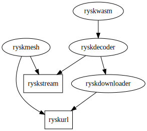
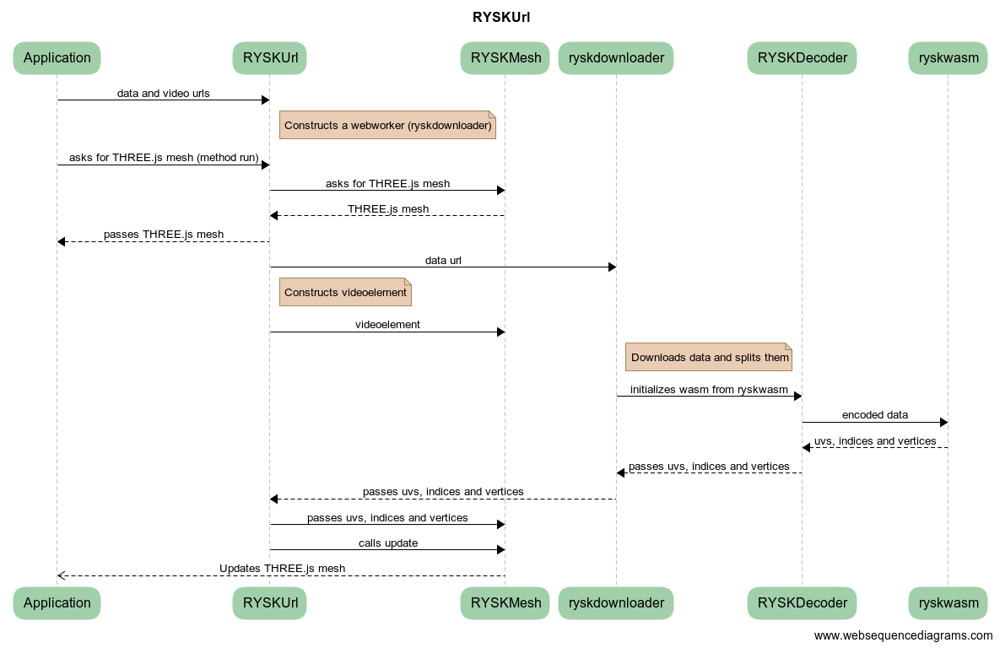
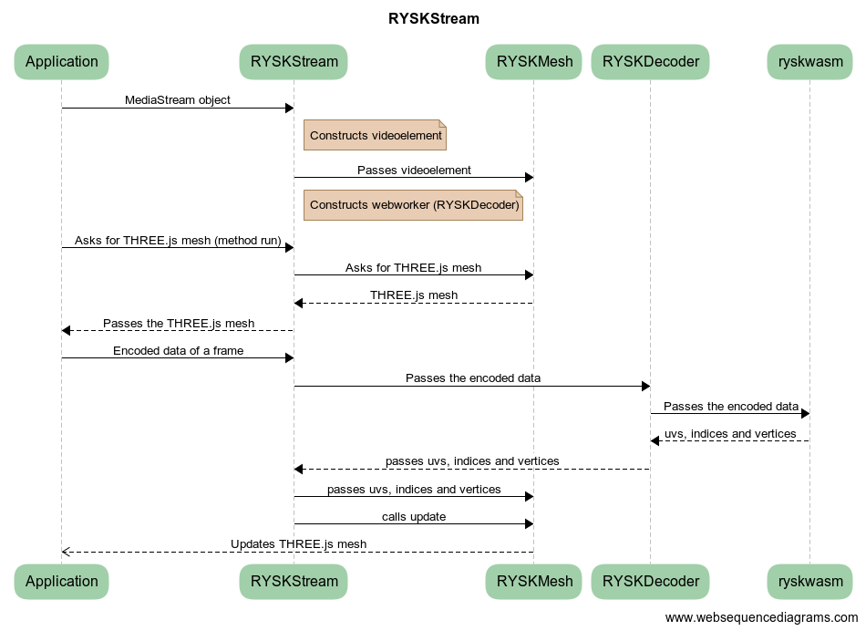

# webUtils
This public repository hosts a package registry containing ``@mantisvision`` javascript libraries. Source codes of the hosted packages are located in a private MantisVision repositiry.
NPM packages can be downloaded from the package registry https://npm.pkg.github.com using the scope ``@mantisvision``.
The main libraries are meant to be working alongside [Three.js](https://threejs.org/) which is also listed as one of the dependencies.

## Table of contents
  * [Installing a package in your project](#installing-a-package-in-your-project)
  * [Which package to choose](#which-package-to-choose)
  * [Inner architecture](#inner-architecture)
    * [Dependencies](#dependencies)
    * [Data flow](#data-flow)
  * [Description and API](#description-and-api)

## Installing a package in your project
You can install any of the packages with its dependencies using either Yarn (v1 or v2) or NPM. You have to
specify custom package registry for ``@mantisvision`` packages. For npm, you have to edit either your global or your
project's ``.npmrc`` file and add the following lines:
```
@mantisvision:registry=https://npm.pkg.github.com
//npm.pkg.github.com/:_authToken=your_git_auth_token_here
```
For Yarn v1, you have to edit ``.yarnrc`` and add the following line:
```
"@mantisvision:registry" "https://npm.pkg.github.com"
```
For Yarn v2, you have to edit ``.yarnrc.yml`` and add the following:
```yaml
npmScopes:
  mantisvision:
    npmRegistryServer: "https://npm.pkg.github.com"
    npmAuthToken: "your_git_auth_token_here"
```
In order to install a specific package using NPM, run one of the following commands:
```
npm i @mantisvision/rysk
npm i @mantisvision/ryskurl
npm i @mantisvision/ryskstream
npm i @mantisvision/ryskdownloader
npm i @mantisvision/ryskdecoder
npm i @mantisvision/ryskmesh
npm i @mantisvision/ryskwasm
npm i @mantisvision/utils
npm i @mantisvision/sentryintegration
```
If you prefer using Yarn, run one of the following:
```
yarn add @mantisvision/rysk
yarn add @mantisvision/ryskurl
yarn add @mantisvision/ryskstream
yarn add @mantisvision/ryskdownloader
yarn add @mantisvision/ryskdecoder
yarn add @mantisvision/ryskwasm
yarn add @mantisvision/ryskmesh
yarn add @mantisvision/utils
yarn add @mantisvision/sentryintegration
```

## Which package to choose
The simplest option is to install just ``@mantisvision/rysk`` package. It bundles all other rysk* packagesand exports RYSKStream and RYSKUrl objects.
The source code is minified and packed in the single javascript file. Workers and Webassembly files are inlined. This means you shouldn't need
any special loader for webworkers or wasm in your own package bundler. ``@mantisvision/rysk`` was built using Webpack 5, but due to the inling, it should
be usable across common package builders. However, it must be used inside a browser which supports webassembly and webworkers (currently, all common modern
browsers do).

The six "partial" packages (ryskurl, ryskstream, ryskdownloader, ryskdecoder, ryskwasm and ryskmesh) are meant for advanced development where only some features are needed
and the rest won't be used or are meant to be substituted by your own program. Beside this, the sum of all source code sizes is smaller than in the case
of ``@mantisvision/rysk`` because webassembly and workers aren't inlined. On the other hand, it might need a little bit more configuration
in your personal package bundler to correctly load these parts. Currently, only Webpack 5 is supported. This doesn't mean the packages won't work with
other bundlers, but you must figure the right configuration for correctly loading webassembly (from ``@mantisvision/ryskwasm``) and possible webworkers
(if you use ``@mantisvision/ryskurl`` or ``@mantisviosion/ryskstream``).

If you use Webpack 5, the only additional configuration option you should define in your ``webpack.config.js`` file is this one:
```javascript
// in module.exports.module.rules
{
	test: /\.wasm$/,
	type: 'asset/resource' //or 'asset/inline' if you prefer to inline wasm code
}
```
As for the webworkers, your webpack should by itself automatically emit seperate files containing their code. This is because in both
``@mantisvision/ryskurl`` and ``@mantisvision/ryskstream``, the workers are created similar to this:
```javascript
const worker = new Worker(new URL("./package.worker.js",import.meta.url));
```
Webpack 5 will automatically recognizes this code and does what is necessary.

In the most cases, you would only need ``@mantisvision/ryskurl`` and/or ``@mantisvision/ryskstream`` packages as they provide "ready-to-use"
main functionality. If you want to develop your application for a custom environment (e.g. as a server application or as a WeChat
mini program), you should study the following chapter in order to grasp a better understanding of inner links between packages,
so you can accuratly decide which packages you can use and which you need to reimplement using your own code.

## Inner architecture
This chapter will in short describe how the partial ``@mantisvision/rysk*`` packages are connected.

### Dependencies
The following diagram shows dependencies between packages:


The core of the library is in the packages ``@mantisvision/ryskwasm`` and ``@mantisvision/ryskmesh``.
The entry points are usually ``@mantisvision/ryskurl`` and ``@mantisvision/ryskstream``.

### Data flow
The following diagrams show a simplified data flow between the packages. "Application" represents a custom program which
uses these libraries.

It is important to remember that data doesn't flow sequentially like in the diagrams. Decoding runs in parallel with
updating the resulting THREE.js mesh. Each time decoder decodes a frame, it sends decoded uvs, vertices and indices via callbacks
to either RYSKUrl or RYSKStream and they have to pass the data to RYSKMesh which during the nearest call of update (or
"requestVideoFrameCallback" event) updates THREE.js mesh.





## Description and API
Detailed description of APIs of packages can be found here:
* [@mantisvision/rysk](./docs/rysk.md)
* [@mantisvision/ryskurl](./docs/ryskurlryskstream.md)
* [@mantisvision/ryskstream](./docs/ryskurlryskstream.md)
* [@mantisvision/ryskmesh](./docs/mesh.md)
* [@mantisvision/ryskdownloader](./docs/downloader.md)
* [@mantisvision/ryskdecoder](./docs/decoder.md)
* [@mantisvision/ryskwasm](./docs/ryskwasm.md)
