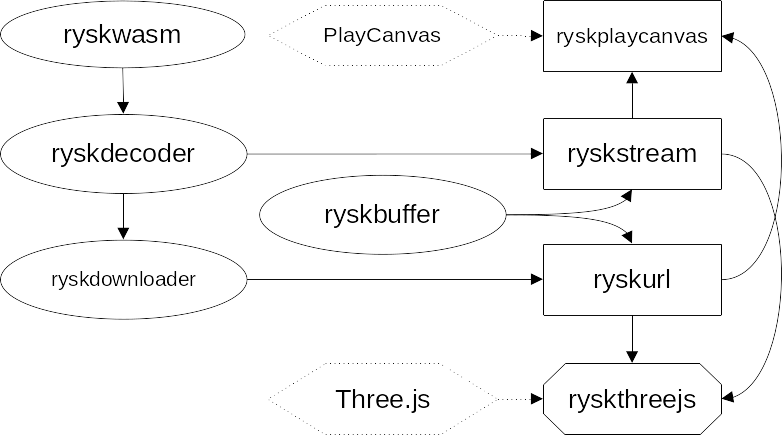

# webUtils
This public repository hosts a package registry containing ``@mantisvision`` javascript libraries. Source codes of the hosted packages are located in a private MantisVision repositiry.
NPM packages can be downloaded from the package registry https://npm.pkg.github.com using the scope ``@mantisvision``.

# Breaking change in the visibility of mesh
Meshes constructed by ``@mantisvision/ryskthreejs`` and ``@mantisvision/ryskplaycanvas`` have by default visibility set
to false. This is because many users would prefer to show some sort of LOADING inscription or icon till the video/data
is sufficiently buffered. In order to see the meshes, set their visibility property to true after inserting into the scene.

## Table of contents
  * [Installing a package in your project](#installing-a-package-in-your-project)
  * [Which package to choose](#which-package-to-choose)
    * [For Three.js](#for-threejs-implementation)
    * [For Playcanvas](#for-playcanvas-implementation)
    * [For A-Frame](#for-a-frame-implementation)
    * [For a custom integration](#for-a-custom-implementation)
    * [Synchronizing multiple RYSK videos](#synchronizing-multiple-rysk-videos)
  * [Inner architecture](#inner-architecture)
    * [Dependencies](#dependencies)
    * [Data flow](#data-flow)
  * [HLS support](#hls-support)
  * [Description and API](#description-and-api)

## Installing a package in your project
You can install any of the packages with its dependencies using either Yarn (v1 or berry) or NPM. You have to
specify custom package registry for ``@mantisvision`` packages. For npm, you have to edit either your global or your
project's ``.npmrc`` file and add the following lines:
```
@mantisvision:registry=https://npm.pkg.github.com
//npm.pkg.github.com/:_authToken=your_git_auth_token_here
```
For Yarn v1, you have to edit ``.yarnrc`` and add the following line:
```
"@mantisvision:registry" "https://npm.pkg.github.com"
```
For Yarn berry, you have to edit ``.yarnrc.yml`` and add the following:
```yaml
npmScopes:
  mantisvision:
    npmRegistryServer: "https://npm.pkg.github.com"
    npmAuthToken: "your_git_auth_token_here"
```
In order to install a specific package using NPM, run one of the following commands:
```
npm i @mantisvision/rysk
npm i @mantisvision/ryskaframe
npm i @mantisvision/ryskthreejs
npm i @mantisvision/ryskplaycanvas
npm i @mantisvision/ryskurl
npm i @mantisvision/ryskstream
npm i @mantisvision/ryskdownloader
npm i @mantisvision/ryskdecoder
npm i @mantisvision/ryskbuffer
npm i @mantisvision/ryskwasm
npm i @mantisvision/utils
npm i @mantisvision/sentryintegration
npm i @mantisvision/synchronizer
```
If you prefer using Yarn, run one of the following:
```
yarn add @mantisvision/rysk
yarn add @mantisvision/ryskaframe
yarn add @mantisvision/ryskthreejs
yarn add @mantisvision/ryskplaycanvas
yarn add @mantisvision/ryskurl
yarn add @mantisvision/ryskstream
yarn add @mantisvision/ryskdownloader
yarn add @mantisvision/ryskdecoder
yarn add @mantisvision/ryskwasm
yarn add @mantisvision/ryskbuffer
yarn add @mantisvision/utils
yarn add @mantisvision/sentryintegration
yarn add @mantisvision/synchronizer
```

## Which package to choose

### For Three.js implementation
The simplest option is to install just ``@mantisvision/rysk`` package. It bundles all other rysk-* packages and exports RYSKStream/StreamMesh 
and RYSKUrl/URLMesh classes (each couple in fact represents the same class, but named differently for backwards compatibility).
The source code is minified and packed in the single javascript file. Workers and webassembly files are inlined. This means you shouldn't need
any special loader for webworkers or wasm in your own package bundler. ``@mantisvision/rysk`` was built using Webpack 5, but due to the inlining, it should
be usable across common package builders. However, it must be used inside a browser which supports webassembly and webworkers (currently, all common modern
browsers do).

To keep smaller size of the installed packages, one can install ``@mantisvision/ryskthreejs``. This package depends on other ``@mantisvision`` libraries
and downloads and installs them separately. The combined size of the source codes is smaller than in the previous case, because webworkers and wasm
aren't inlined. This, however, may require a specific settings in your package bundler in order to properly load all the scripts.
For instance, in the case of Webpack 5, you might need to add the following configuration to ``webpack.config.js`` you use for building
your project:
```javascript
...
module: {
	{
		test: /\.wasm$/,
		type: 'asset/resource'
	},
...
```
As for the webworkers, Webpack 5 should by itself automatically emit seperate files containing their code. This is because in both
``@mantisvision/ryskurl`` and ``@mantisvision/ryskstream``, the workers are created similar to this:
```javascript
const worker = new Worker(new URL("./package.worker.js",import.meta.url));
```
Webpack 5 will automatically recognize this code and does what is necessary.

Bear in mind that ``@mantisvision/ryskthreejs`` exports classes named StreamMesh (Three.js mesh created from mediastream) 
and URLMesh (Three.js mesh created from video and data urls), but not RYSKStream and RYSKUrl akin to ``@mantisvision/rysk``,
(although, as was stated, in ``@mantisvision/rysk`` these are in fact the same classes, but named differently). 
The change was made to prevent confusion, because ``@mantisvision/ryskurl`` and ``@mantisvision/ryskstream`` themselves 
export RYSKUrl and RYSKStream which are, however, different than StreamMesh and URLMesh (in particular, StreamMesh 
and URLMesh are meant to provide actual Three.js 3D meshes, whereas RYSKUrl and RYSKStream from ``@mantisvision/ryskurl``
and ``@mantisvision/ryskstream`` are now entirely decoupled from Three.js and only provide decoded data and canvas which
gets updated with the current frame).

### For Playcanvas implementation

For the integration with the PlayCanvas engine (either in its library form or directly in the PlayCanvas editor), there
is ``@mantisvision/ryskplaycanvas`` package. It also contains the whole rysk library for the PlayCanvas packed into a 
single file for use in an environment without npm/yarn or package builder e.g. in the PlayCanvas editor (for more information,
see [@mantisvision/ryskplaycanvas documentation](./docs/playcanvas.md)).

### For A-Frame implementation

There is an A-Frame integration package called ``@mantisvision/ryskaframe``, but due to the nature of A-Frame itself, it is
a bit specific. Even though A-Frame seemingly uses Three.js under the hood, in truth it is built on Three.js fork called
super-three (see [this GitHub issue](https://github.com/aframevr/aframe/issues/4898) ). This means that the integration
using the existing package ``@mantisvision/ryskthreejs`` is not possible. Furthermore, A-Frame library doesn't have traditional
module exports (rather it creates a global AFRAME variable) and so neither does ``@mantisvision/ryskaframe``.
It must be therefore imported only after the A-Frame library, and only then it registers its own components.

Beside a traditional, small dependency package, ``@mantisvision/ryskaframe`` offers also a complete, minified, single-file
build similar to ``@mantisvision/rysk``. That one can be used directly in the script tag of HTML header. However, the file
doesn't contain A-Frame library within it, so again, A-Frame must be imported prior to this package.

More information can be found in [@mantisvision/ryskaframe documentation](./docs/aframe.md)


### For a custom implementation

The six "partial" packages (ryskurl, ryskstream, ryskdownloader, ryskdecoder, ryskwasm and ryskbuffer) are meant for advanced 
development where only some features are needed and the rest won't be used, or will be substituted by developer's own program.
In particular, they can be utilized to integrate RYSKUrl and RYSKStream with other different rendering engines beside
Three.js or Playcanvas. In the most cases, you would only need ``@mantisvision/ryskurl`` and/or ``@mantisvision/ryskstream``
packages as they provide "ready-to-use" main functionality. The basic guide for integration development can be found
[here](./docs/integrationguide.md)

If you, however, intend to develop your application for a special environment (e.g. as a fully server application or as 
a WeChat mini program), you should study the following chapter in order to grasp a better understanding of inner links between packages,
so you can accuratly decide which packages you can use and which you need to reimplement using your own code.

### Synchronizing multiple RYSK videos
In order to synchrhonize multiple RYSK videos (as well as HTMLVideoElements), one can use a utilitarian package
``@mantisvision/synchronizer``. The synchronized objects must either descend from the ``RYSKUrl`` class (``@mantisvision/ryskurl``,
 ``@mantisvision/ryskplaycanvas``, ``@mantisvision/ryskthreejs``) or ``HTMLVideoElement``. Alternatively, they can implement
 ``SynchronizableObject`` interface from ``@mantisvision/synchronizer``, but this is only for a very specific needs and advanced
 users.

 The documentation and the API can be found [here](./docs/synchronizer.md).

## Inner architecture
This chapter will in short describe how the partial ``@mantisvision/rysk*`` packages are connected.

### Dependencies
The following diagram shows dependencies between packages:


The core of the library is in the packages ``@mantisvision/ryskwasm`` and ``@mantisvision/ryskbuffer``.
The entry points are usually ``@mantisvision/ryskurl`` and ``@mantisvision/ryskstream`` or one of the integration
packages (currently ``@mantisvision/ryskthreejs`` or ``@mantisvision/ryskplaycanvas``).

### Data flow
The following diagrams show a simplified data flow between the packages. "Application" represents a custom program which
uses these libraries.

It is important to remember that data doesn't always flow sequentially like in the diagrams. In order to synchronize
decoded data with the video, the data must be sometimes buffered or video paused (in case of RYSKUrl), or some frames
from the incoming stream have to be omitted. The latter happens in the case of RYSKStream, since this is most likely
a realtime video and as such it can't be paused and wait for the proper data. It is therefore necessary for the third 
party developer using RYSKStream to provide encoded data with zero delay relatively to the video stream, otherwise
the tearing due to the skipped frames will be visible.


## HLS Support
``@mantisvision/rysk*`` libraries currently support HTTP Live Streaming for the part of video texture. Support for
HLS for volumetric data (i.e. SYK/RYSK) is a "work in progress". More about the support can be found [here](./docs/hlssupport.md)

## Description and API
Detailed description of APIs of packages can be found here:
* [@mantisvision/rysk](./docs/rysk.md)
* [@mantisvision/ryskthreejs](./docs/threejs.md)
* [@mantisvision/ryskplaycanvas](./docs/playcanvas.md)
* [@mantisvision/aframe](./docs/aframe.md)
* [@mantisvision/ryskurl](./docs/ryskurlryskstream.md)
* [@mantisvision/ryskstream](./docs/ryskurlryskstream.md)
* [@mantisvision/ryskbuffer](./docs/buffer.md)
* [@mantisvision/ryskdownloader](./docs/downloader.md)
* [@mantisvision/ryskdecoder](./docs/decoder.md)
* [@mantisvision/ryskwasm](./docs/ryskwasm.md)
* [@mantisvision/synchronizer](./docs/synchronizer.md)

## Samples
* [Standalone library sample](./samples/standalone)
* [NPM packages sample](./samples/npm)
* [Stream sample](./samples/stream)
* [PlayCanvas editor sample](./samples/PlayCanvasEditor)
* [Synchronizer sample](./samples/synchronized)

