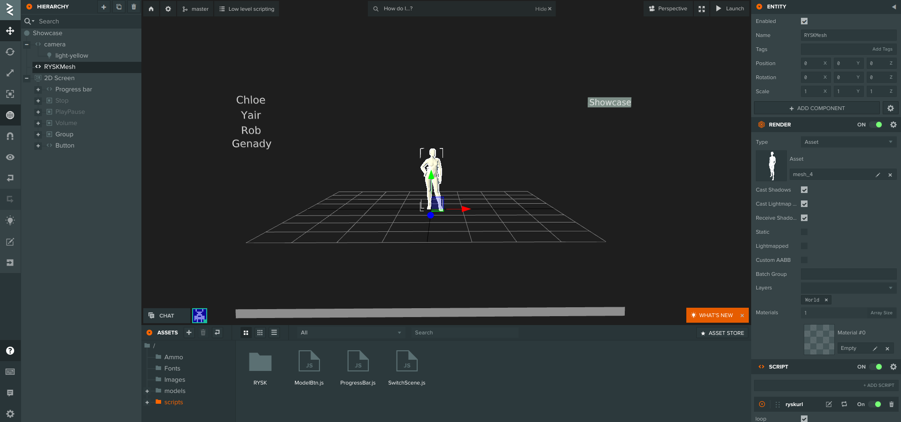

# PlayCanvas editor sample project

This project showcases the use ``@mantisvision/ryskplaycanvas`` library in the environment of PlayCanvas editor. 
To see the description of the library itself, you can read its documentation [here](../../docs/playcanvas.md).
The sample can be accessed, reviewed and forked [directly through playcanvas.com](https://playcanvas.com/project/939297/overview/chatxr-playcanvas-tests)

The directory with the sample also contains an additional ``src`` directory with the unminified source code of the three
custom scripts which are attached to the entities representing the RYSK mesh (``PlayCanvasRYSKUrl.js``), the progress
bar (``ProgressBar.js``) and the buttons pointing towards different URLs of various models (``ModelBtn.js``). A minified
source code of ``@mantisvision/ryskplaycanvas`` is also present.

This documentation presents a guide to creating the sample project. At least a rudimentary knowledge of javascript and
the Playcanvas editor environment is assumed. The sample doesn't necessary present the most optimal way for your personal 
project; instead, it should rather provide an inspiration for your own integration based on your specific needs.

## Table of contents
1. [Scene composition](#scene-composition)
2. [Custom scripts](#custom-scripts)
  2.1 [Mantisvision library](#21-mantisvision-library)
  2.2 [RYSK mesh script](#22-rysk-mesh-script)
  2.3 [Progress bar](#23-progress-bar)
  2.4 [Model buttons](#24-model-buttons)

## 1. Scene composition
First, add all the necessary entities into the scene.
There is a 2D screen which carries all of the UI elements:

- four buttons representing four different 3D models, 
- Play/Pause, Stop and Volume buttons (all of them disabled by default till the mesh loads)
- Progress bar consisting of the outer "shell" and the inner progress "fill" with the text entity for diplaying the frame number

The main entity representing the RYSK mesh itself is positioned in the center of the scene. It will connect to the UI elements
and displays the 3D model based on the clicked button.


## 2. Custom scripts
To add a functionality to the scene, four custom scripts need to be added to the projects.

### 2.1 Mantisvision library
Playcanvas ediotr currently doesn't provide an integral way to use the NPM packages, so the standalone minified version
of the ``@mantisvision/ryskplaycanvas`` library must be loaded manually. The script is called ``MantisRYSKPlayCanvas.min.js``
and is part of the NPM package ``@mantisvision/ryskplaycanvas``. If you use directly this minified standalone version,
you don't need to install any other dependencies because all of the RYSK dependencies are already included in the package
and the only external dependency - the PlayCanvas engine - is already present in the editor's environment and will be
passed through the ``window.Rysk.URLMesh`` constructor parameter.

Upload the file with the library to the scripts folder in your PlayCanvas editor project (you can create a separate
RYSK subdirectory for it if you wish).

### 2.2 RYSK mesh script
This will be the main script of the project. Create an empty script in the file PlayCanvasRYSKUrl.js and attach it to the
RYSKMesh entity as a script component (the final script can be found [here](./src/PlayCanvasRYSKUrl.js)). 
Its purpose is to load the Mantisvision library and expose its API to the other entities in the PlayCanvas editor. For brevity,
the script will be internally called ryskurl:

```javascript
var Ryskurl = pc.createScript('ryskurl');
```

Then add 5 configurable attributes which will link the RYSK mesh entity with the UI elements and allow to configure whether
the played video should loop:

```javasscript
// true - video will loop, false - video stops at the end
Ryskurl.attributes.add('loop', { type: 'boolean',default: false });
//entity for showing the progress of the video
Ryskurl.attributes.add('progressbar', {type: 'entity', description: 'Progressbar showing the play progress of the mesh', default: false});
//button for playing/pausing the video
Ryskurl.attributes.add('playpausebutton', {type: 'entity', description: 'Button for Playing/Pausing', default: false});
//button for stopping the video
Ryskurl.attributes.add('stopbutton', {type: 'entity', description: 'Button to stop the video', default: false});
//button for turning the volume on/off
Ryskurl.attributes.add('volumebutton', {type: 'entity', description: 'Button for turning the volume on/off', default: false});
```

You could also add an attribute to connect it to the four buttons specifing the 3D models, but in this sample project, we 
do that the opposite way by adding the proper attribute to the script attached to these buttons (see the chapter
[2.4 Model buttons](#24-model-buttons)).

The initialize method of the ryskurl script will declare and define three properties to store the internal state of a Ryskurl
instance, the video and the data URLs and a reference to the RYSK object created by ``@mantisvision/ryskplaycanvas`` library.
This is the heart of the script onto which various calls shall be proxied:

```javascript
this.playing = false;   // whether the video is currently playing
this.sound = true;      // whether the sound is turned on
this.buffering = false; // whether the video is buffering
this.dataURL = '';
this.videoURL = '';
this.ryskObj = null;
```

Then follows the creation of specific event listener functions by binding ``this`` to the methods which already exist
as memebers of ryskurl script object. Without the binding, the listeners wouldn't have access to ``this`` once they were triggered
as callbacks of the event listeners, and if they were anonymous functions, they couldn't be manually detached to mitigate
the risk of memory leaks.

```javascript
//create the listeners by binding "this" object so they can access it from within when they're called
this.showFrameNoThis = this.showFrameNo.bind(this);
this.showBufferingThis = this.showBuffering.bind(this);
this.bufferingFinishedThis = this.bufferingFinished.bind(this);
this.updateRyskObjThis = this.updateRyskObj.bind(this);
this.loopVideoThis = this.loopVideo.bind(this);
this.canplaythroughThis = this.canplaythrough.bind(this);
```
The update() method of the ryskObj must be called periodically, so that the texture and the mesh of the 3D model are updated
in accordance with the playing video. This is normally done in the ``update`` method of the custom script which PlayCanvas 
editor automatically calls each rendered frame, however, there were issues with synchronization of the texture
and the mesh on Firefox and old Safari browsers unless the ryskObj wasn't updated in ``window.requestAnimationFrame``
callback. Therefore we detect the browser type based on "requestVideoFrameCallback" method being availible for the
HTMLVideoElement since both, the Firefox and the old Safari (prior to 15.4), don't have this method.

```javascript
this.firefox = !("requestVideoFrameCallback" in HTMLVideoElement.prototype);
...
if (this.firefox)
{//periodically call the update method on the rysk object
    window.requestAnimationFrame(this.updateRyskObjThis);
}
...

/**
 * For the Firefox and the old Safari on MacOS, update() method of ryskObj must be called in requestAnimationFrame
 * of window, otherwise there might be issues with the texture.
 */
Ryskurl.prototype.updateRyskObj = function()
{
    if (this.ryskObj !== null) this.ryskObj.update();
    window.requestAnimationFrame(this.updateRyskObjThis);
};

/**
 * For other browsers, we can rely on update() method which is automatically called by PlayCanvas each rendering frame.
 */
Ryskurl.prototype.update = function()
{
    if (!this.firefox && this.ryskObj !== null) 
    {//the first part of if checks whther browser isn't Firefox or old Safari (they have event name lodeddata and use requestAnimationFrame callback instead)
        this.ryskObj.update();
    }
};

```

If the attributes of the script were set through the Playcanvas editor, we bind event listeners for "click" on the various
buttons:

```javascript
//handle the play/pause button
if (this.playpausebutton)
{
	this.playpausebutton.element.on("click",() => 
	{
		if (this.ryskObj)
		{
			if (this.playing) this.ryskObj.pause();
			else
			{
				this.ryskObj.play();
				//show the mesh in case it's hiddne
				this.ryskObj.getMesh().visible = true;
			} 
			this.playing = !this.playing;
			this.playpausebutton.children[0].element.text = this.playing ? "Pause" : "Play"; //change the text of the button
		}
	});
}

//handle the button for turning the volume up/down
if (this.volumebutton)
{
	this.volumebutton.element.on("click",() => 
	{
		if (this.ryskObj)
		{
			if (this.sound) this.ryskObj.setVolume(0);
			else this.ryskObj.setVolume(1);
			this.sound = !this.sound;
			this.volumebutton.children[0].element.text = this.sound ? "Volume OFF" : "Volume ON"; //change the text of the button
		}
	});
}

 //handle the stop button
if (this.stopbutton)
{
	this.stopbutton.element.on("click",() => 
	{
		if (this.ryskObj)
		{
			this.ryskObj.stop();
			this.ryskObj.getMesh().visible = false; //hide the mesh
			if (this.progressbarObj) this.progressbarObj.setProgress(0); //reset the progress bar
			this.playing = false;
			if (this.playpausebutton) this.playpausebutton.children[0].element.text = "Play";
			this.frameNo.element.text = 0;
		}
	});
}
```

We also connect to the Progress bar entity if its given. The entity is going to carry its own custom script (see 
[2.3 Progress bar](#23-progress-bar)) which will allow to register a callback on a ``jump`` event. The progress will emit this
event each time a user clicks somewhere on the progress bar and the callback receives a specific timestamp in seconds.

```javascript
//handle the progress bar
if (this.progressbar)
{
	const scripts = this.progressbar.findComponents("script");
	//get reference to progressBar script in order to use its API
	for (var script of scripts)
	{
		if ("progressBar" in script)
		{
			this.progressbarObj = script.progressBar;
			break;
		}
	}

	this.showProgressThis =  this.showProgress.bind(this);
	this.handleProgressbarClickThis = this.handleProgressbarClick.bind(this);
	//attach listener for "jump" event in order to jump to the given timestamp
	this.progressbarObj.on("jump",this.handleProgressbarClickThis);
}
...

/**
 * Callback bound to the jump event of the progress bar
 * @param {float} timestamp time in seconds where the video should jump.
 */
Ryskurl.prototype.handleProgressbarClick = function(timestamp) 
{
    if (this.ryskObj)
    {
        this.ryskObj.jumpAt(timestamp);
    }
};
```

The most important part of the ``initialize`` method is importing the ``@mantisvision/ryskplaycanvas`` library, so it can
be used for creating the RYSK meshes. The URL of the library file can be obtained using editor's functions
to get the asset of the given name and its URL. Using standard browser ``import`` function, the library can be loaded 
in the PlayCanvas environment and a new ``window.Rysk`` global variable shall be registered and can be used once 
the import is finished:
``` javascript
this.importFinished = new Promise((resolve,reject) => 
{
	if (!window.hasOwnProperty("Rysk"))
	{//import the library, but only if the Rysk global variable hasn't been set yet (that would mean the library was already imported)
		const asset = pc.Application.getApplication().assets.find('MantisRYSKPlayCanvas.min.js');
		import(asset.getFileUrl()).then(() => 
		{
			resolve();
		});
	}else 
	{
		resolve();
	}
});

```
The ``import`` function is asynchronous and returns a promise. It is wraped in our own new promise so we can test whether
the import wasn't done already (i.e. ``window.Rysk`` already exists). The reference to this new Promise is kept in
``importFinished`` for use in the ``play`` method.

The ``play`` method is the main public part of the script's API. It is meant to be called externally from a different
script (in our sample case from the [Model buttons](#24-model-buttons)) and its parameters are URLs of a file with a
RYSK data and a file with a video. Once the import is finished (by waiting for ``importFinished`` property being resolved) 
a new mesh is created:

```javascript
/**
 * The main method of this script which is called to create a new RYSK mesh, place it
 * into the scene and start playing it.
 * @param {String} dataURL url of the .syk file
 * @param {String} videoURL url of the video
 */
Ryskurl.prototype.play = function(dataURL,videoURL)
{
    if (this.ryskObj && (!dataURL || !videoURL))
    {//remove an already existing ryksObj if dataURL or videoURL aren't set
        this.dispose();
    }else if (this.ryskObj === null || (this.dataURL !== dataURL && this.videoURL !== videoURL))
    {//if dataURL or videoURL have changed or ryskObj hasn't been created yet
        this.dataURL = dataURL;
        this.videoURL = videoURL;
        
        this.importFinished.then(() => 
            {// once the import of the @mantisvision/ryskplaycanvas library is finished...
                window.Rysk.MantisLog.SetLogLevel(4);
                this.dispose(); //...destroy an existing ryskObj...
                this.createMesh(window.Rysk.URLMesh,dataURL,videoURL); //...and create a new one
            });
    }else
    {//if nothing has changed, merely trigger play() on the ryskObj
        this.playing = true;
        this.ryskObj.play();
    }
};
```

``createMesh`` further continues with the creation of the mesh. It is passed both URLs and, furthermore, a reference to
``URLMesh`` class which is instantiated. The reference to the resulting object is saved to ``ryskObj`` property and
callbacks are attached to the various events.

```javascript
// Create a new ryskObj using URLMesh class. The third argument is reference to the global
// PlayCanvas object and the fourth is the default size of the internal buffer which is used
// to store the RYSK data.
this.ryskObj = new URLMesh(videoURL,dataURL,pc,50);
```

There are two ways how to ensure the video loops if the ``loop`` attribute is set to ``true``. You can simply set the
``ryskObj.loop`` property to ``true``. However, if you have more than one RYSK mesh in your scene, Safari on iOS may
automatically mute one or both of them when they loop because it doesn't like multiple videos playing at once. You can
try to circumvent this issue by looping the video manually in the following way:
1) set ``ryskObj.loop`` property to false
2) register a callback on the "ended" event
3) in the callback, first mute the video by calling ``ryskObj.setVolume(0)``
4) then call ``ryskObj.play()`` 
5) after cca 500ms unmute the video (you can see this procedure in ``Ryskurl.prototype.playVideo`` method, since it's also used when you want to autoplay the video)

```javascript
this.ryskObj.loop = false;
this.ryskObj.onVideoEvent("ended",this.loopVideoThis);
...
Ryskurl.prototype.loopVideo = function()
{
    if (this.loop)
    {
        this.playVideo();
    }
};
```
Progress bar is updated on each ``timeupdate`` event of the video by calling the ``setProgress`` method from the progress bar
script component (see [2.3 Progress bar](#23-progress-bar)). Also, the duration of the video must be passed to this script
once it's available, so it can correctly display the current timeline progress. In a similar fashion, the frame number
will be displayed each time a new frame from the video is decoded:
```javascript
this.ryskObj.onVideoEvent("timeupdate",this.showProgressThis);
this.ryskObj.getDuration().then(duration => this.progressbarObj.setDuration(duration));

this.ryskObj.on("dataDecoded",this.showFrameNoThis);
this.ryskObj.on("buffering",this.showBufferingThis);
this.ryskObj.on("buffered",this.bufferingFinishedThis);
...
/**
 * Callback bound to timeupdate event of the video from RYSK mesh
 */
Ryskurl.prototype.showProgress = function()
{
    if (this.progressbar)
    {
        this.progressbarObj.setProgress(this.ryskObj.getVideoElement().currentTime);
    }
};

/**
 * Callback which gets triggered each time a new frame is decoded. It is responsible for showing the frame number
 * on the screen.
 */
Ryskurl.prototype.showFrameNo = function(data)
{
    if (!this.buffering && this.progressbarObj)
    {
        this.progressbarObj.setFrameNo(data.frameNo);
    }
};

/**
 * Callback which gets triggered if the video or data starts to buffer. It shows "Buffering..." text
 * instead of the frame number and mutes the video to avoid a possible issue with iOS.
 */
Ryskurl.prototype.showBuffering = function()
{
    this.buffering = true;
    if (this.sound && this.ryskObj) this.ryskObj.setVolume(0);
    if (this.progressbarObj)
    {
        this.progressbarObj.setFrameNo("Buffering...");
    }
};

/**
 * Callback which gets triggered once the buffering is finished. It sets the volume back to normal.
 */
Ryskurl.prototype.bufferingFinished = function()
{
    console.log("Finished buffering");
    this.buffering = false;
    if (this.sound) setTimeout(() => this.ryskObj.setVolume(1),500);
};
```
The main part of ``createMesh`` method is calling to ``ryskObj.run()``. It returns a promise which gets resolved with
a PlayCanvas ``meshInstance`` object which can be then inserted into the scene via a new ``render`` component attached to the
same entity this script belongs to.

```javascript
this.ryskObj.run().then(meshInstance => 
{
	if (meshInstance)
	{
		meshInstance.visible = true; //meshinstance has the visibility set to false by default
		//display the control elements
		if (this.playpausebutton) this.playpausebutton.enabled = true;
		if (this.volumebutton) this.volumebutton.enabled = true;
		if (this.progressbar) this.progressbar.enabled = true;
		if (this.stopbutton) this.stopbutton.enabled = true;
		//add the mesh instance to the scene as a render component of this entity
		this.entity.addComponent('render',{ meshInstances: [meshInstance] });
	}
});
```
Bear in mind that the promise resolves only after ``ryskObj.play()`` has been called; that is only after the video and
the RYSK data decoding processes have been started. You can for instance start playing video once the internal HTMLVideoElement
emits ``canplaythrough`` event:
```javascript
this.ryskObj.onVideoEvent("canplaythrough",this.canplaythroughThis);
...
/**
 * Callback which is triggered onnce canplaythrough video event is fired. At that moment, it calls
 * playVideo() method of this script()
 */
Ryskurl.prototype.canplaythrough = function()
{
    if (this.ryskObj)
    {
        this.ryskObj.offVideoEvent("canplaythrough",this.canplaythroughThis);
        this.playVideo();
    }
};

```
The ``playVideo`` method wraps ``ryskObj.play()`` method in the code which should ensure that the video can be played
unmuted on iOS Safari. However, the solution is rather "hacky" and it's not guaranteed it will work forever:
```javascript
Ryskurl.prototype.playVideo = function()
{
    if (this.ryskObj !== null) 
    {
        this.ryskObj.setVolume(0); //mute the video. On iOS, only muted video can be autoplayed
        this.ryskObj.play().then(() => 
        {
            this.playing = true; //playing property is to true just to better handle play/pause button
            setTimeout(() => 
            {//after a certain delay (in this case 0.5s) umnute the video. this should trick iOS into playing it
                this.ryskObj.setVolume(this.sound ? 1 : 0);
                if (this.volumebutton) 
                {//change the text on the volume button
                    this.volumebutton.children[0].element.text = "Volume " + (this.sound ? "OFF" : "ON");
                }
            },500);
        });
    }
};
```
Also bear in mind that mobile browsers aren't very cooperative when it comes to autoplaying the video on site, and a user
interaction (e.g. clicking on a button) is often required before the video can be played.

It is advisable to manually dispose the RYSK object once it is not needed. This will ease the work for the javascript
garbage collector and can prevent accidental memmory leaks:
```javascript
Ryskurl.prototype.dispose = function()
{
    if (this.ryskObj !== null)
    {
        const obj = this.ryskObj;
        this.ryskObj = null;

        obj.off("buffering",this.showBufferingThis);
        obj.off("buffered",this.bufferingFinishedThis);
        obj.off("dataDecoded",this.showFrameNoThis);
        obj.offVideoEvent("ended",this.loopVideoThis);
        if (this.progressbar)
        {
            obj.offVideoEvent("timeupdate",this.showProgressThis);
        }
        this.entity.removeComponent('render');
        obj.dispose();
    }
};
```

### 2.3 Progress bar
Create a script called ``ProgressBar.js`` and attach it as a script component to the topmost ProgressBar element. It will allow other scripts
(in this particular case the ``PlayCanvasRYSKUrl.js`` script) to set the length of the progress bar, set the current
status/frame number and listen on ``jump`` events when to user wants to jump to a different time position in the video.
The full code of this script can be found [here](./src/ProgressBar.js).

The script has two attributes, so it can connect the outer progress bar entity to the inner progress "filling" and to the text
for displaying the current frame number.
```javascript
ProgressBar.attributes.add('progressImage', {type: 'entity'});
ProgressBar.attributes.add('frameNo', { type: 'entity',default: false });
```
Initialize method attaches a callback to ``click`` event on the progress bar entity which will handle the user's attempt to
jump to a different timestamp. The callback calculates the proper timestamp from the position where the click has occured
and the ``duration`` property (which at this time must be already set through the ``setDuration`` method) and fires
``jump`` event. 
```javascript
ProgressBar.prototype.initialize = function() 
{
    this.duration = 0;
    this.entity.element.on("click",this.handleClick.bind(this));
};

/**
 * Callback which listens for click event on the progress bar and fires jump event which the RYSK script
 * listens for to jump to a proper timestamp in the video.
 */
ProgressBar.prototype.handleClick = function(event) 
{
    if (this.duration > 0)
    {
        const touchX = event.x - this.entity.element.canvasCorners[0].x;
        const realWidth = this.entity.element.canvasCorners[1].x - this.entity.element.canvasCorners[0].x;
        this.fire("jump", touchX / realWidth * this.duration);
    }
};
```
``setDuration``, ``setProgress`` and ``setFrameNo`` methods serve as a public API for other scripts (e.g. ``PlayCanvasRYSKUrl.js``):
```javascript
/**
 * Exposed API, so that the script handling RYSK object can set the duration of the video.
 */
ProgressBar.prototype.setDuration = function(duration)
{
    this.duration = duration;
};

/**
 * Exposed API, so that the script handling RYSK object can change the progress bar based
 * on the current timestamp of the video.
 */
ProgressBar.prototype.setProgress = function(timestamp)
{
    if (this.duration > 0 && timestamp > 0)
    {
        this.progressImage.element.width = timestamp > this.duration
                                        ? this.entity.element.width
                                        : Math.round(timestamp / this.duration * this.entity.element.width);
    }else
    {
        this.progressImage.element.width = 0;
    }
};

/**
 * Display either the frame number or some other text inside the progress bar (e.g. "Buffering...")
 */
ProgressBar.prototype.setFrameNo = function(text)
{
    if ("element" in this.frameNo && "text" in this.frameNo.element)
    {
        this.frameNo.element.text = text;
    }
};
```

### 2.4 Model buttons
Create an empty script in the file ``ModelBtn.js`` and attach it as a script component to each button which should serve
for switching between different 3D models. The entity for the RYSK mesh is passed as a script attribute and so are the
video URL and the data URLs:
```javascript
ModelBtn.attributes.add('RYSKMesh', { type: 'entity', description: 'Mesh controlled by this button' });
ModelBtn.attributes.add('videoURL', { type: 'string' });
ModelBtn.attributes.add('dataURL', { type: 'string' });
```
In the ``initialize`` method, a callback is attached to the ``click`` event of the button. Inside, the script component
of the RYSK mesh entity is located and its ``play`` method executed:
```javascript
ModelBtn.prototype.initialize = function() 
{
    // attach event listener on click of the button 
    this.entity.button.on('click', function(event) 
    {
        const scripts = this.RYSKMesh.findComponents("script");
        for (var script of scripts)
        {
            if ("ryskurl" in script)
            {
                script.ryskurl.play(this.dataURL,this.videoURL);
                break;
            }
        }
    }, this);
};
```
